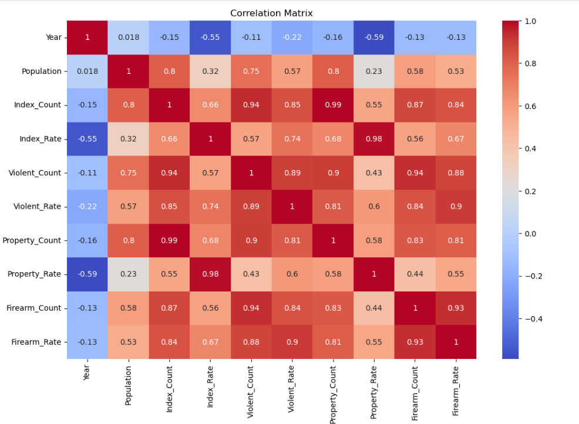

# Correlation Matrix Analysis

  

## Insights from the Correlation Matrix Heatmap

### 1. Strong Positive Correlation Between Violent Crime and Firearm Crime

The heatmap shows a strong positive correlation between:

- **Violent_Rate**
- **Firearm_Rate**

This means that when violent crime increases, firearm crime also tends to increase.

**Key Insight:**
> Firearm-related crimes are strongly associated with violent crime levels.

---

### 2. Property Crime Also Positively Correlates with Violent Crime

**Property_Rate** has a positive relationship with **Violent_Rate**.

Counties or years with high property crime often experience higher violent crime as well.

**Key Insight:**
> Areas with increased property crime generally tend to show elevated violent crime rates.

---

### 3. Firearm Crime and Property Crime Have Moderate Correlation

The relationship between firearm crime and property crime is positive but weaker than the correlation between firearm crime and violent crime.

**Key Insight:**
> Firearm crime is more closely linked to violent offenses than property-related crimes.

---

### 4. Strong Correlations Indicate Related Crime Patterns

Most crime variables move in the same direction, suggesting that they may be influenced by common underlying factors such as:

- Poverty
- Unemployment
- Population density
- Social inequality

**Key Insight:**
> The correlation matrix indicates that different crime categories may be influenced by similar socioeconomic conditions.

---

### 5. Correlation Does Not Mean Causation

Although variables are strongly related, one crime type does not directly cause another.

The heatmap only shows statistical relationships between variables.

**Key Insight:**
> The heatmap identifies relationships between crime categories but does not prove direct causation.

---

## Overall Conclusion

The correlation heatmap reveals strong positive relationships among violent, property, and firearm crime rates. Violent crime shows the strongest association with firearm crime, suggesting that regions with higher violent crime often experience increased firearm-related incidents. The analysis indicates that multiple crime categories may be influenced by similar social and economic factors.
