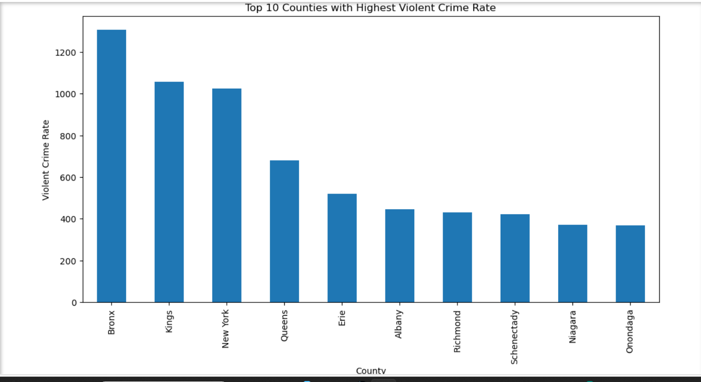

# Top 10 Counties with Highest Violent Crime Rate

  

## Insights from the Top 10 Counties with Highest Violent Crime Rate

### 1. Bronx Has the Highest Violent Crime Rate

Bronx County recorded the highest average violent crime rate in the dataset.

- Average Violent Crime Rate ≈ **1307**
- Significantly higher than all other counties

**Key Insight:**
> Bronx stands out as the most violent crime-affected county in the dataset.

---

### 2. Kings and New York Counties Also Show Extremely High Rates

The following counties also recorded exceptionally high violent crime rates:

| County | Average Violent Crime Rate |
|----------|----------:|
| Kings County | 1059 |
| New York County | 1024 |

These counties experience substantially higher violent crime levels than the remaining counties.

**Key Insight:**
> Kings and New York counties consistently experience high violent crime rates, indicating major urban crime concentration.

---

### 3. Large Gap Between Top Counties and Others

The top three counties all have violent crime rates above **1000**, while most remaining counties in the top 10 have rates below **700**.

This demonstrates a significant imbalance in crime distribution.

**Key Insight:**
> Violent crime is heavily concentrated in a few counties rather than spread evenly across the state.

---

### 4. Urban Counties Dominate the Top Rankings

The counties with the highest violent crime rates are major urban centers:

- Bronx
- Kings (Brooklyn)
- New York (Manhattan)
- Queens

These areas have large populations and dense urban environments.

**Key Insight:**
> Highly populated urban counties tend to have higher violent crime rates.

---

### 5. Erie and Albany Show Moderate but Noticeable Crime Levels

| County | Average Violent Crime Rate |
|----------|----------:|
| Erie County | 519 |
| Albany County | 446 |

Although considerably lower than the top three counties, these counties still rank among the highest in the dataset.

**Key Insight:**
> Mid-level counties still show considerable violent crime activity compared to smaller counties.

---

### 6. Lower Counties in the Top 10 Are Relatively Stable

Counties such as:

- Niagara
- Onondaga
- Schenectady
- Richmond

have average violent crime rates ranging between **350 and 430**.

**Key Insight:**
> The lower-ranked counties in the top 10 show comparatively moderate violent crime levels.

---

## Overall Conclusion

The analysis reveals that violent crime is strongly concentrated in highly urbanized counties such as Bronx, Kings, and New York County. Bronx County recorded the highest average violent crime rate in the dataset. The significant gap between the top counties and the rest suggests that population density and urban socioeconomic conditions may strongly influence violent crime levels.
