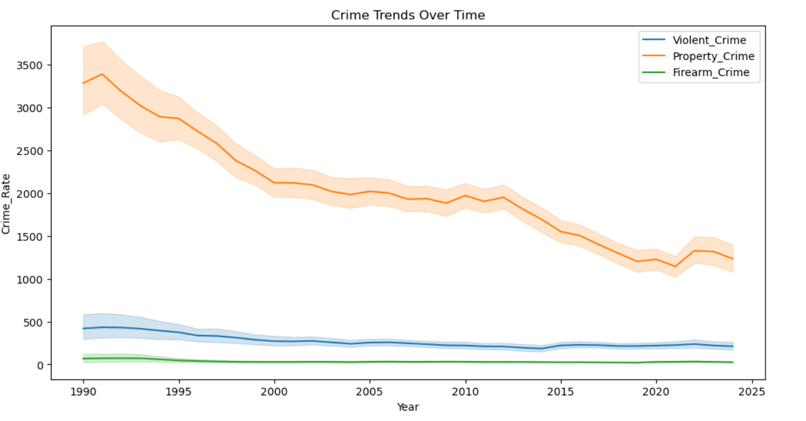

<h2 align="center">Crime Trends Over Time</h2>

  

<h3 align="left">Crime Trend Insights</h3>

### 1. Property Crime Has the Highest Rate

The **Property Crime Rate** is consistently much higher than both violent and firearm crime rates throughout the years. This means crimes like theft, burglary, and property damage occur more frequently than violent crimes.

**Example Insight:**
> Property crimes dominate overall crime statistics across all years.

---

### 2. Overall Crime Rates Decrease Over Time

All three crime categories show a general downward trend from the early years to recent years.

This suggests improvements in:
- Law enforcement
- Public safety measures
- Crime prevention programs

**Example Insight:**
> Crime rates have gradually decreased over time, indicating improved public safety.

---

### 3. Violent Crime Shows Moderate Fluctuations

Violent crime does not decrease smoothly. Some years show slight increases and decreases, meaning violent crime is less stable compared to property crime.

**Example Insight:**
> Violent crime rates fluctuate over the years but still show an overall decline.

---

### 4. Firearm Crime Rate Is the Lowest

Firearm-related crimes remain significantly lower than other crime categories. However, spikes in firearm crime may align with increases in violent crime.

**Example Insight:**
> Firearm crime remains the least common crime type in the dataset.

---

### 5. Similar Pattern Between Violent and Firearm Crime

The violent crime and firearm crime lines may move similarly in some periods. This suggests a possible relationship between firearm incidents and violent offenses.

**Example Insight:**
> Firearm crime trends appear to correlate with violent crime trends.

---

## Numerical Insights from the Dataset

### Average Crime Rates in 1990

| Crime Type | Average Rate |
|------------|-------------:|
| Violent Crime | 419 |
| Property Crime | 3286 |
| Firearm Crime | 67 |

### Average Crime Rates in 2024

| Crime Type | Average Rate |
|------------|-------------:|
| Violent Crime | 211 |
| Property Crime | 1235 |
| Firearm Crime | 26 |

### Key Findings

- Violent crime reduced by almost **50%**
- Property crime reduced by nearly **60%**
- Firearm crime reduced significantly over the study period

---

## Conclusion

The graph demonstrates a long-term decline in crime rates across all categories. Property crime remains the most common type of crime, while firearm crime is comparatively low. Despite some fluctuations, the overall trend indicates significant improvements in crime reduction over time.
